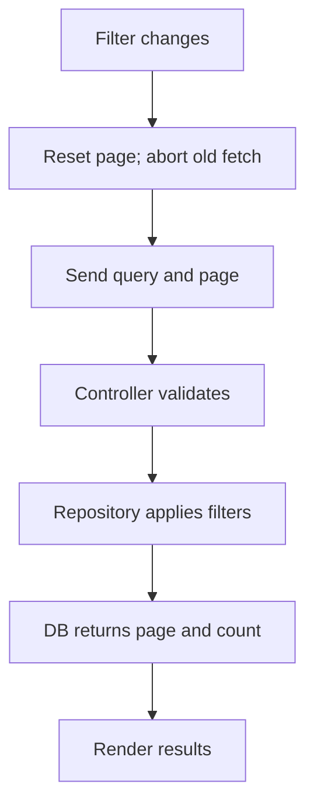

# Patch notes

## Code changes and reasons

| Changed file | What changed and why |
| --- | --- |
| `backend/src/main/java/com/internal/tasktracker/TaskRepository.java` | Grouped title/description matches under archive/status filters; added paged results and count query to avoid loading all matches. |
| `backend/src/main/java/com/internal/tasktracker/TaskController.java` | Returns 400 for invalid status/page/size; normalizes inputs; uses database paging; removes artificial delay and logging. |
| `db/queries/search_tasks.sql` | Keeps H2 reference filtering consistent. |
| `db/oracle/task_search_package.sql` | Aligns Oracle count and row filters so totals match results. |
| `frontend/src/api.js` | Adds fetch cancellation support; removes debug logging. |
| `frontend/src/hooks/useTasks.js` | Aborts obsolete requests; clears errors on load and stale results on failure. |
| `frontend/src/App.jsx` | Resets to page 1 when filters change. |

## Search request flow

Predicate: `not archived AND (title OR description matches) AND optional status`. Response shape is unchanged.

## Scope, risk, and verification

Writes/authentication are out of scope. Unindexed substring searches may slow as data grows. Used Copilot to inspect/review. Frontend build and local filter, paging, proxy, and validation checks passed.

Handwritten explanation photos are not included. Add your own handwritten notes under `handwritten/` before submission.
