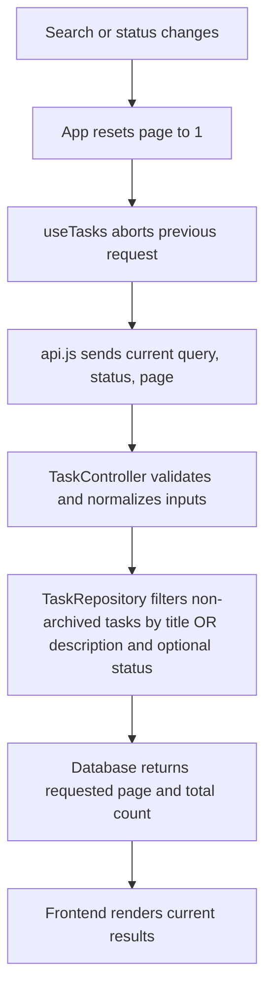

# Patch notes

## Code changes and reasons

| File | Change and reason |
| --- | --- |
| `backend/.../TaskRepository.java` | Grouped title/description OR conditions to keep archive/status filters correct; added database pagination and count query to avoid loading all matches. |
| `backend/.../TaskController.java` | Validates status and page bounds, normalizes search consistently, uses paged queries, and removes artificial delay. |
| `db/queries/search_tasks.sql` | Mirrors corrected filtering in the H2 reference query. |
| `db/oracle/task_search_package.sql` | Corrects both Oracle count and result filters so totals match returned rows. |
| `frontend/src/api.js` | Supports abort signals and removes per-request debug logging. |
| `frontend/src/hooks/useTasks.js` | Cancels obsolete requests and clears stale errors/results, preventing outdated data from replacing current search results. |
| `frontend/src/App.jsx` | Resets pagination to page 1 when filters change, avoiding empty out-of-range pages. |

## Search request flow

The intended SQL predicate is `not archived AND (title OR description matches) AND status matches when supplied`.

## Scope, risk, and verification

Write operations and authentication were left untouched to keep this focused on search. Unindexed substring matching may slow down as the table grows. I used GitHub Copilot to inspect and review the React, Spring, and SQL changes. `npm run build` succeeded; local API checks covered filters, pagination, proxying, and invalid-parameter responses.

Handwritten explanation photos are not included. Add your own handwritten notes under `handwritten/` before submission.
